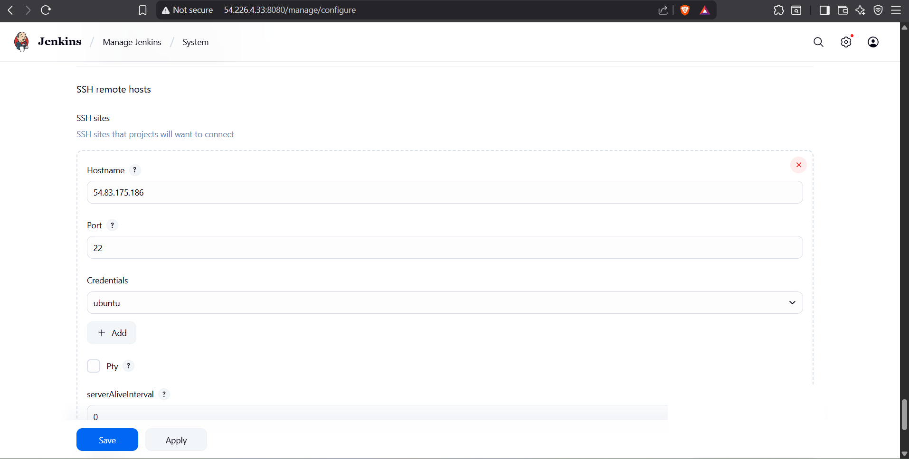
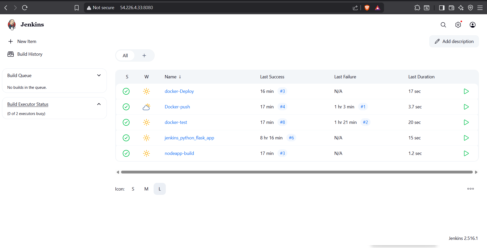
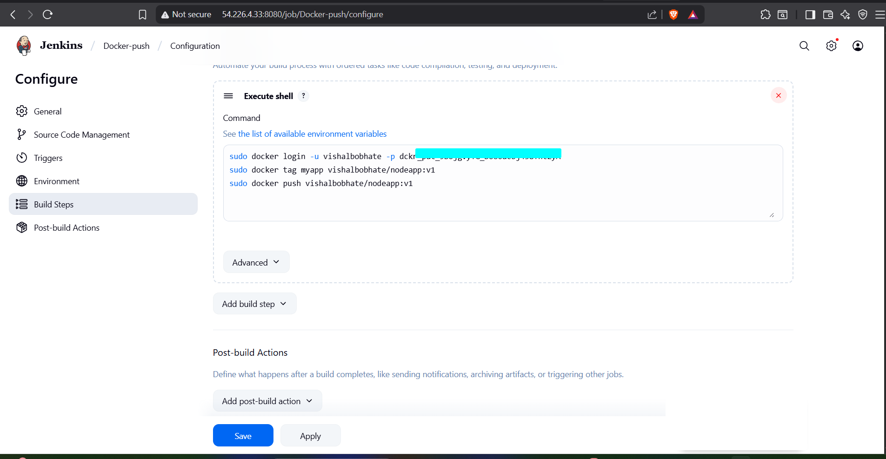
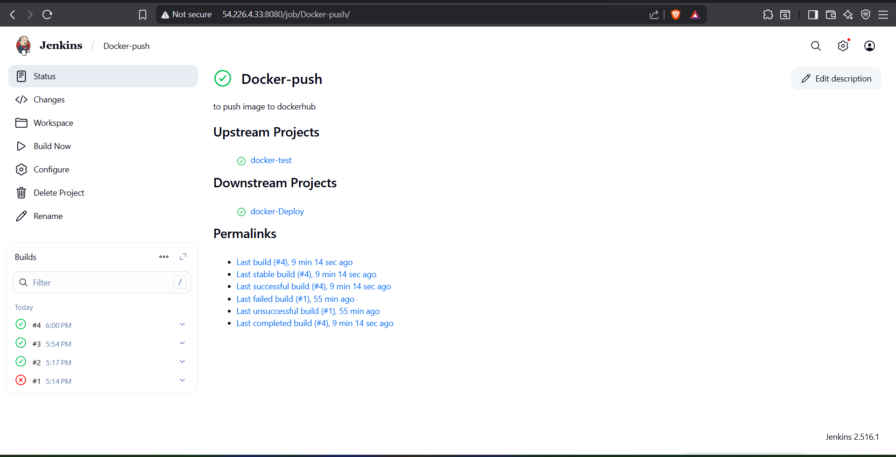
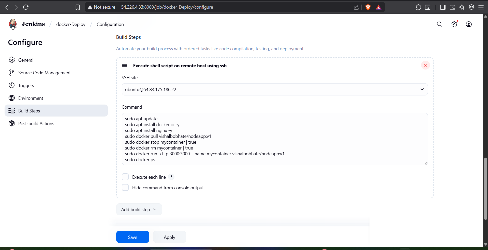
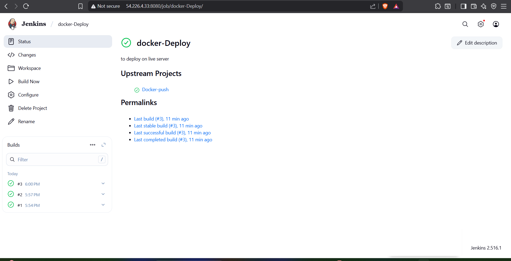
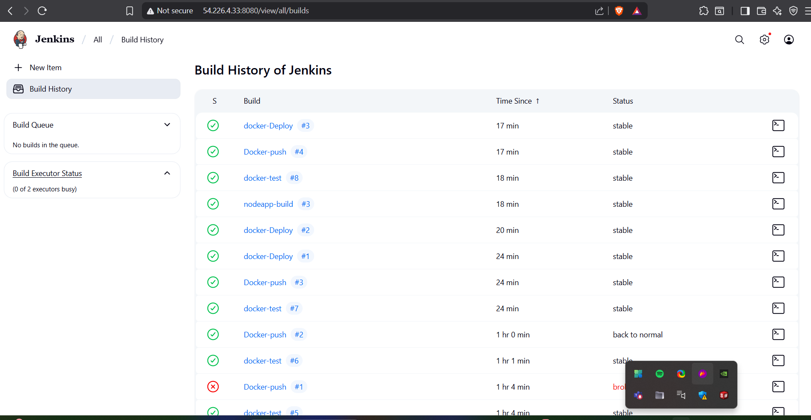
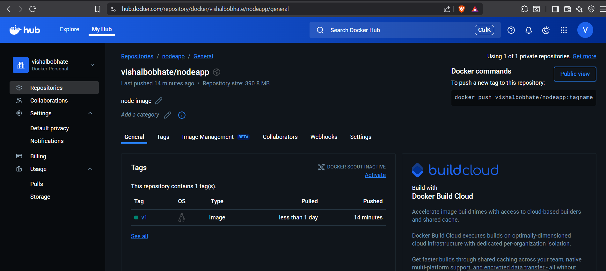
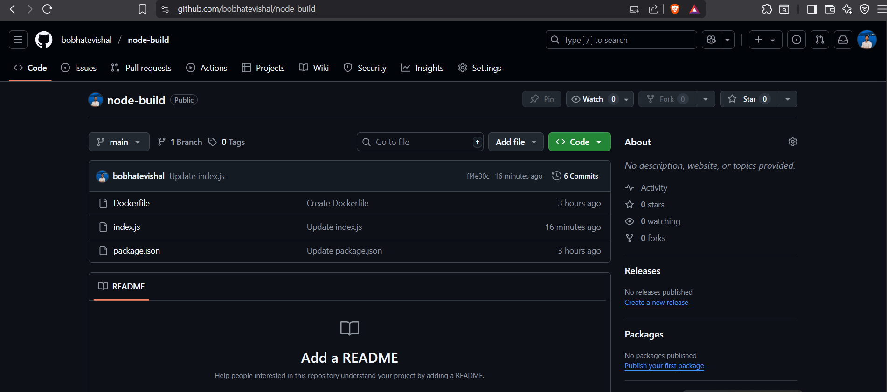
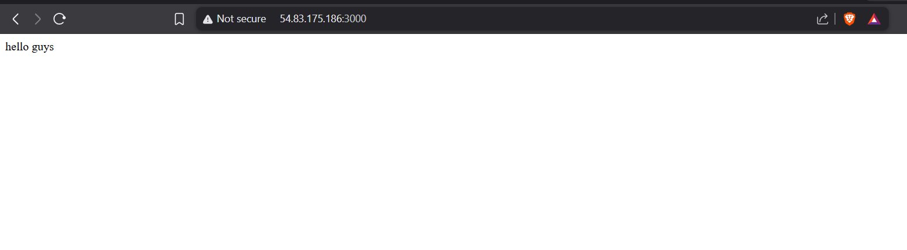

# 🚀 CI/CD for Node.js App using Jenkins + Docker + SSH Deployment

This project demonstrates a complete CI/CD pipeline with **Jenkins**, **Docker**, and **DockerHub** to build, test, push, and deploy a Node.js application on a live server using **SSH credentials**.

---

## 📦 Project Structure

```
node-build/
├── index.js          # Node.js application
├── package.json      # Dependencies
└── Dockerfile        # Docker configuration
```

---

## 🌐 Live Deployment

**URL:** [http://54.83.175.186:3000](http://54.83.175.186:3000)
**Output:** `hello guys`

---

## 🔁 CI/CD Pipeline Overview

This pipeline consists of **4 Jenkins Jobs**:

| Stage         | Jenkins Job Name | Description                                   |
| ------------- | ---------------- | --------------------------------------------- |
| 🧪 Test       | `docker-test`    | Runs Docker build to test image creation      |
| 📤 Push       | `Docker-push`    | Tags and pushes image to DockerHub            |
| 🚀 Deploy     | `docker-Deploy`  | Pulls image and runs container on live server |
| 🔄 Multistage | `nodeapp-build`  | Ties all stages for full automation           |

---

## 🔧 Jenkins Configuration (Step-by-Step)

### 1️⃣ `docker-test`: Test Build

```bash
# Just builds the Docker image
sudo docker build -t myapp .
sudo docker images
```

---

### 2️⃣ `Docker-push`: Push to DockerHub

```bash
# Login, tag, and push image to DockerHub
sudo docker login -u vishalbobhate -p <your_dockerhub_token>
sudo docker tag myapp vishalbobhate/nodeapp:v1
sudo docker push vishalbobhate/nodeapp:v1
```

---

### 3️⃣ `docker-Deploy`: Deploy to EC2 via SSH

* SSH Config: `ubuntu@54.83.175.186:22`
* Jenkins SSH Credentials setup done

```bash
sudo apt update
sudo apt install docker.io -y
sudo apt install nginx -y
sudo docker pull vishalbobhate/nodeapp:v1
sudo docker stop mycontainer || true
sudo docker rm mycontainer || true
sudo docker run -d -p 3000:3000 --name mycontainer vishalbobhate/nodeapp:v1
sudo docker ps
```

---

### 4️⃣ `nodeapp-build`: Job Sequencing

This job uses Jenkins' **upstream/downstream** linking:

* `docker-test` ⟶ `Docker-push` ⟶ `docker-Deploy`
* Fully automated from code update to live deployment 🚀

---

## 🐳 DockerHub Output

Image pushed successfully:
🔗 [`vishalbobhate/nodeapp:v1`](https://hub.docker.com/repository/docker/vishalbobhate/nodeapp)

---

## 📂 GitHub Repo

Code hosted at:
🔗 [`bobhatevishal/node-build`](https://github.com/bobhatevishal/node-build)

---

## 📸 Project Screenshots

| 📌 Description            | Preview                                            |
| ------------------------- | -------------------------------------------------- |
| Jenkins SSH Configuration |  |
| Docker Test Job           |                              |
| Docker Push Config        |        |
| Push Status               |                |
| Docker Deploy Config      |       |
| Docker Deploy Job         |                 |
| Jenkins Build History     |               |
| DockerHub Image           |          |
| GitHub Code               |                             |
| Live Web Output           |                           |

---


## 💬 Author

**Vishal Bobhate**
🔗 [GitHub](https://github.com/bobhatevishal) | 🌐 DevOps & Cloud Enthusiast | 💼 Open to Opportunities
